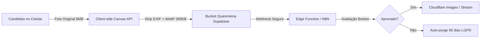

# WB Casting Intelligence Platform (WB-CIP)
## Arquitetura de Software & Guia de Engenharia Frontend Sênior
**Engenharia & Design de Sistemas:** RVIVAC Guild (Peruíbe - SP)  
**Cliente:** WB Scouting Agency (Willes)  
**Versão:** 1.0.0 (Produção)

---

## 1. Visão Geral e Princípios Arquiteturais

A **WB Casting Intelligence Platform (WB-CIP)** foi concebida para substituir o modelo de desenvolvimento tradicional superdimensionado (Angular + Java/Spring + Supabase) por uma arquitetura moderna, serverless, desacoplada e ultra-otimizada.

### Diretrizes de Engenharia:
1. **Zero Overengineering:** Eliminação total de camadas intermediárias de backend (JVM/Spring). O Next.js (App Router) consome o Supabase diretamente, utilizando **Row Level Security (RLS)** para autorização nativa no banco.
2. **Estética Editorial RVIVAC Guild:** Minimalismo suíço, tipografia técnica monoespacada combinada com grotesque moderno, paleta estritamente neutra (preto `#000`, branco `#FFF`, cinzas neutros de alto contraste) e ausência total de ornamentos visuais vazios.
3. **Core Web Vitals Rigorosos:**
   - **LCP (Largest Contentful Paint) < 1.2s:** Imagens servidas em WebP/AVIF via Cloudflare Images com `priority` explícito na dobra.
   - **CLS (Cumulative Layout Shift) = 0.00:** Aspect-ratios estritos em todos os containers de mídia (`3:4` para fotos de casting, `16:9` para stream reels).
   - **INP (Interaction to Next Paint) < 100ms:** Filtros e buscas de casting executados client-side em memória com memoização reativa.
4. **Economia de Egress & Quarentena LGPD:** Pré-compressão e strip de metadados EXIF no próprio navegador do candidato via Canvas API antes do upload para o bucket seguro.

---

## 2. Estrutura de Diretórios Recomendada (Next.js App Router)

```text
wb-scouting/
├── app/
│   ├── (admin)/                     # Rotas Autenticadas do Backoffice
│   │   ├── admin/
│   │   │   ├── casting/             # Gestão e CRUD de modelos e fotos
│   │   │   ├── candidatures/        # Kanban de triagem do scouting
│   │   │   └── layout.tsx           # Layout com verificação de auth/role
│   ├── (public)/                    # Rotas Públicas Otimizadas para SEO
│   │   ├── casting/
│   │   │   └── page.tsx             # Catálogo público completo
│   │   ├── models/[slug]/
│   │   │   └── page.tsx             # Perfil dinâmico do modelo e composite
│   │   ├── scouting/
│   │   │   └── page.tsx             # Funil "Quero ser modelo"
│   │   ├── page.tsx                 # Home institucional com Hero Stream
│   │   └── layout.tsx               # Shell público com Header e Footer
│   ├── globals.css                  # Tailwind CSS e regras de @page para PDF
│   └── layout.tsx                   # Root layout HTML com fontes editoriais
├── components/
│   ├── casting/
│   │   ├── CastingCatalog.tsx       # Listagem assíncrona com filtros em tempo real
│   │   ├── ModelCard.tsx            # Card editorial com proporção 3:4
│   │   └── ModelComposite.tsx       # Gerador dinâmico de Composite A4 para PDF
│   ├── home/
│   │   └── HeroStream.tsx           # Hero com streaming Cloudflare e fallback LCP
│   ├── layout/
│   │   ├── Header.tsx               # Header editorial com seletor PT/EN
│   │   └── Footer.tsx               # Rodapé técnico com conformidade e assinatura
│   ├── model/
│   │   └── ModelProfileView.tsx     # Tabela biométrica, abas sob demanda e WhatsApp
│   └── scouting/
│       └── ScoutingFunnel.tsx       # Formulário multi-etapas com compressão e LGPD
├── lib/
│   ├── supabase/
│   │   ├── client.ts                # Cliente Supabase Isomórfico (Browser)
│   │   └── server.ts                # Cliente Supabase Server Component/Actions
│   └── utils/
│       ├── formatters.ts            # Formatação biométrica (métrica/imperial) e sanitização
│       └── image-compression.ts     # Utilitário client-side de Canvas/WebP
├── supabase/
│   ├── functions/
│   │   └── scouting-webhook/        # Edge Function Deno/TS para disparo N8N
│   │       └── index.ts
│   └── schema.sql                   # DDL completo, RLS, enums, triggers e buckets
├── types/
│   ├── casting.ts                   # Tipos de domínio e estado de filtros
│   └── database.types.ts            # Tipagens geradas do Supabase PostgreSQL
├── ARCHITECTURE.md                  # Este documento
├── package.json
└── tailwind.config.ts
```

---

## 3. Segurança de Dados & Isolamento via RLS

Todas as tabelas possuem **Row Level Security (RLS)** ativo por padrão:

| Tabela | Operação | Permissão | Regra / Política |
| :--- | :--- | :--- | :--- |
| `models` | `SELECT` | Público | `is_active = TRUE` |
| `models` | `ALL` | Autenticado | Booker/Admin via função `is_admin_or_booker()` |
| `model_media` | `SELECT` | Público | Mídias com `is_published = TRUE` e modelo ativo |
| `candidatures` | `INSERT` | Anônimo | Permitido apenas com `lgpd_consent_given = TRUE` |
| `candidatures` | `SELECT/UPDATE/DELETE`| Autenticado | Exclusivo para equipe de scouting/bookers |
| `storage.objects` | `INSERT` (scouting) | Anônimo | Apenas no bucket `scouting-quarantine` |
| `storage.objects` | `SELECT` (scouting) | Autenticado | Bookers autenticados (privado) |

---

## 4. Pipeline de Mídia & Otimização de Custos



1. **Compressão no Browser:** Reduz em até 95% o tráfego e o custo de storage no Supabase.
2. **Cloudflare Images:** Redimensionamento inteligente no Edge, entrega em AVIF/WebP de acordo com o navegador.
3. **Cloudflare Stream:** Vídeo da hero da home transmitido em HLS/DASH adaptativo, sem travar conexões móveis.
4. **Composite Dinâmico:** Gerado via CSS Paged Media `@page { size: A4 portrait; }`, eliminando dependências pesadas de geração de PDF no servidor (`puppeteer` / `pdfkit`).

---

## 5. Variáveis de Ambiente (.env.local)

```bash
# Supabase Configuration
NEXT_PUBLIC_SUPABASE_URL=https://sua-instancia.supabase.co
NEXT_PUBLIC_SUPABASE_ANON_KEY=eyJhbGciOi...

# Cloudflare Configuration
NEXT_PUBLIC_CLOUDFLARE_ACCOUNT_ID=seu_account_id
NEXT_PUBLIC_CLOUDFLARE_IMAGES_DOMAIN=https://imagedelivery.net/seu_hash

# Edge / Webhook Secrets
WEBHOOK_SECRET_KEY=sua_chave_secreta_de_assinatura
N8N_SCOUTING_WEBHOOK_URL=https://n8n.seuservidor.com/webhook/scouting-intake
```
